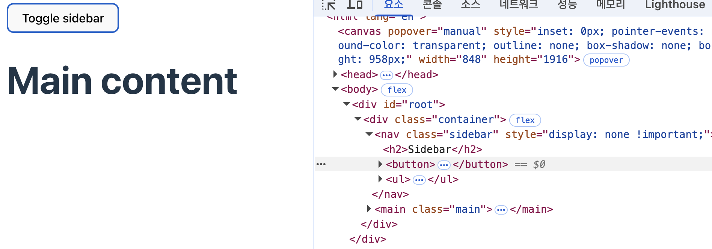
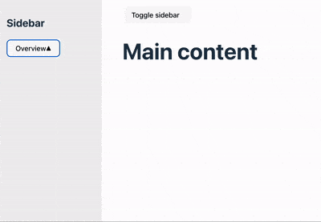
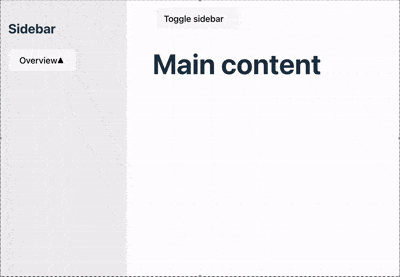

export const metadata = {
  title: 'React 19.2 Activity 컴포넌트에 대해 알아보자',
  description:
    'React 19.2 version 에서 업데이트 된 Activity 컴포넌트에 대해 학습하며 작성했습니다.',
  icon: '',
  image: '/images/blog/dev/activity.webp',
  link: '',
  tags: [
    'Activity 컴포넌트',
    'React 19.2',
    'Activity',
    'React 19.2 Activity',
    '성능 최적화',
  ],
  category: 'dev',
  date: '2025-10-13 15:10:51',
  author: 'JerryChu',
};

## 들어가기 앞서

> React 19.2가 2025년 10월 1일 릴리즈 되었다. 주말에 공식문서를 천천히 읽어보며 다시 내용을 정리한다.

## Activity 컴포넌트 특성

```jsx
<Activity mode={isShowingSidebar ? 'visible' : 'hidden'}>
  <Sidebar />
</Activity>
```

먼저 Activity 컴포넌트는 props를 2가지 가지고 있습니다.

1. children 자식 컴포넌트
2. mode: visible || hidden을 값으로 가짐. 기본 값은 visible

Activity 컴포넌트는 mode 속성에 값이 hidden을 갖게 되면 display: “none” css 속성을 적용해 자식 요소를 숨깁니다.
실행해보니 style 속성에 important로 딱 박혀있네요.



숨겨진 상태에서도 **자식 요소는 props에 반응해 리렌더링하지만**, **다른 컴포넌트들 보다 낮은 우선순위로 처리됩니다.**
컴포넌트가 다시 표시되면 React는 이전 상태가 복원된 자식 요소를 노출하고 해당 상태를 다시 적용합니다.

예시를 들어보겠습니다. 아래는 액티비티 사용 코드의 예시와 영상입니다.

```jsx
import { Activity, useState } from 'react';

import './App.css';
import Sidebar from './components/Sidebar';

export default function App() {
  const [isShowingSidebar, setIsShowingSidebar] = useState(true);

  return (
    <div className="container">
      <Activity mode={isShowingSidebar ? 'visible' : 'hidden'}>
        <Sidebar />
      </Activity>
      <main className="main">
        <button onClick={() => setIsShowingSidebar(!isShowingSidebar)}>
          Toggle sidebar
        </button>
        <h1>Main content</h1>
      </main>
    </div>
  );
}
```



아래는 액티비티 컴포넌트 미사용 코드와 영상입니다.

```jsx
export default function App() {
  const [isShowingSidebar, setIsShowingSidebar] = useState(true);

  return (
    <div className="container">
      {isShowingSidebar && <Sidebar />}
      <main className="main">
        <button onClick={() => setIsShowingSidebar(!isShowingSidebar)}>
          Toggle sidebar
        </button>
        <h1>Main content</h1>
      </main>
    </div>
  );
}
```



두 개의 차이가 보이시나요? `<Activity>` 컴포넌트가 이렇게 상태를 저장할 수 있는 이유는

`<Activity>` 컴포넌트가 "hidden” 상태가 되면, 그 안에 있는 모든 자식들의 Effect를 클린업하게 되고,
자식들의 **컴포넌트들이 언마운트되지만, 자식들의 컴포넌트들을 나중에 다시 사용할 수 있도록 자식들의 상태를 저장합니다.**

리액트는 이러한 방식으로 Activity 컴포넌트가 "백그라운드 활동"을 구현하는 방식을 사용한다고 정의했습니다.
**Activity 컴포넌트를 사용해 다시 사용될 UI와 내부 상태를 유지 및 복원하면서 숨겨진 콘텐츠가 원치 않는 부작용을 일으키지 않도록 할 수 있다고 합니다.**

## 보여질 컨텐츠에 대한 Pre-rendering

위에서는 `<Activity>` 컴포넌트를 통해 콘텐츠를 숨기고 상태를 유지할 수 있는 것에 대한 내용을 다뤘습니다.

하지만 `<Activity>` 컴포넌트를 통해 **컴포넌트를 Pre-rendering 것에도 장점이 있습니다.**
`<Activity>` 컴포넌트는 **초기에는 자식 요소를 숨겨주지만, 다른 보여지는 컴포넌트들보다 낮은 우선순위로 렌더링이됩니다.** 마운트되지 않는 상태로 렌더링이 발생합니다.

이런 Pre-rendering을 통해 컴포넌트를 미리 로드할 수 있습니다. 이후 **hidden에서 상태가 변경될 때 컴포넌트가 더 빠르게 나타나 로딩 시간을 단축**합니다.

## 페이지 렌더링할 때 성능 향상

React는 내부적으로 **'선택적 하이드레이션(Selective Hydration)'이라는 성능 최적화 기능을 포함합니다.**

React는 서버에서 미리 HTML을 만들어서 브라우저에 보내고, 그다음에 **hydration 이라는 과정을 통해 HTML에 JS 이벤트(클릭, 입력 등) 를 연결합니다.**
**큰 페이지 전체를 한꺼번에 하이드레이션** 하면 느려질 수 있죠. 그래서 React는 **Suspense**라는 경계를 만들어서 페이지를 여러 **작은 덩어리(컴포넌트 단위)** 로 나눕니다.

이렇게 나누게된다면, **중요한 부분은 먼저 하이드레이션하고, 나중에 보여도 되는 부분은 천천히 하이드레이션 할 수 있습니다.** 이것을 **선택적 하이드레이션**이라고 합니다.
따라서 **컴포넌트 트리를 개별 단위로 분할함으로써 Suspense는 React가 HTML을 조각 단위로 하이드레이션할 수 있게 해서, 일부가 최대한 빠르게 상호작용 가능하도록 합니다.**

아래 코드를 통해 예시를 들어보겠습니다.
**아래 코드는 모든 컴포넌트를 한번에 렌더링 하게 됩니다.** 만약 Home, Contact 컴포넌트의 렌더링이 늦게된다면,
**렌더링 진행 속에서 사용자가 탭 버튼을 누를 경우 탭 버튼이 반응하지 않는 것처럼 느낄 수 있습니다.** 즉 UX가 좋지 않아집니다.

```jsx
export default function App() {
  const [isShowingSidebar, setIsShowingSidebar] = useState(true);
  const [activeTab, setActiveTab] = useState('contact');

  return (
    <main className="main">
      <button onClick={() => setIsShowingSidebar(!isShowingSidebar)}>
        Toggle sidebar
      </button>
      <h1>Main content</h1>
      <TabButton
        isActive={activeTab === 'home'}
        onClick={() => setActiveTab('home')}
      >
        Home
      </TabButton>
      <TabButton
        isActive={activeTab === 'contact'}
        onClick={() => setActiveTab('contact')}
      >
        Contact
      </TabButton>
      {activeTab === 'home' && <Home />}
      {activeTab === 'contact' && <Contact />}
    </main>
  );
}
```

아래 적힌 코드는 위와 같은 코드에 Suspense 태그를 감쌌습니다.
위와 같은 문제를 해결했지만 초기 렌더링할 때 Suspense에 fallback 속성 속 Loading… 이 표시되기 때문에 UI가 변경됩니다.

이런 문제를 해결하기 위해 Activity 컴포넌트를 사용할 수 있습니다.
Activity 컴포넌트는 자식 요소를 표시하거나 숨기고, Suspense와 마찬가지로 선택적 하이드레이션를 사용합니다.

```jsx
<div className="container">
  <main className="main">
    <button onClick={() => setIsShowingSidebar(!isShowingSidebar)}>
      Toggle sidebar
    </button>
    <h1>Main content</h1>
    <TabButton
      isActive={activeTab === 'home'}
      onClick={() => setActiveTab('home')}
    >
      Home
    </TabButton>
    <TabButton
      isActive={activeTab === 'contact'}
      onClick={() => setActiveTab('contact')}
    >
      Contact
    </TabButton>
    <Suspense fallback={<div>Loading...</div>}>
      {activeTab === 'home' && <Home />}
      {activeTab === 'contact' && <Contact />}
    </Suspense>
  </main>
</div>
```

이제 Activity 컴포넌트 덕분에 React는 Home이나 Contact를 마운트하기 전에 먼저 탭 버튼을 하이드레이션할 수 있습니다.

따라서 Activity 컴포넌트는 단순히 화면에 보였다가 사라지는 역할만 하는 것이 아닌
React에게 “이 부분은 다른 부분과 독립적으로 동작할 수 있어요”라고 알려주는 역할도 합니다.
그럼으로써 React는 페이지 전체를 한 번에 준비하지 않고, **사용자가 먼저 볼 가능성이 높은 부분부터 빠르게 하이드레이션** 할 수 있게 됩니다.

**결과적으로 더 빨리 반응하고 성능이 좋아집니다. 심지어 페이지가 콘텐츠 일부를 숨기지 않더라도, 항상 표시되는 Activity 경계를 추가하여 하이드레이션 성능을 개선할 수 있습니다.**

```jsx
<Activity mode={activeTab === 'home' ? 'visible' : 'hidden'}>
  <Home />
</Activity>
<Activity mode={activeTab === 'video' ? 'visible' : 'hidden'}>
  <Contact />
</Activity>
```
