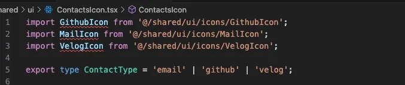
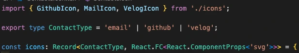

export const metadata = {
  title: '컴포넌트 export의 여러가지 방법',
  description:
    'React 컴포넌트를 왜 export default를 하는지에 대한 의문을 가지고 생각해봤습니다.',
  icon: '',
  image: '/images/blog/dev/component-export.webp',
  link: '',
  tags: ['컴포넌트 export 방법', 'export default', '컴포넌트 export default'],
  category: 'dev',
  date: '2025-07-28 14:15:00',
  author: 'JerryChu',
};

## 들어가기 앞서

> 프로젝트를 개발할 때 단축키를 써서 템플릿을 만들어 사용하다보면 export default를 자동으로 추가되는 경우가 많았습니다.
> 처음에는 편리하게 느껴졌지만, 몇 가지 불편한 점들이 눈에 띄기 시작했습니다.
> 이 경험을 통해 느낀점과 함께, 그 과정에서 얻게 된 인사이트를 공유해보고자 합니다.

## export default를 사용할 때 import 하는 방식



### 내가 느낀 문제점

1. githubIcon가 import해오는 경로가 앞뒤로 중복된다
2. 같은 폴더에서 import 하지만 구조분해 할당을 못한다

즉 한줄로 받아올 수 있는 것을 3줄로 import 해온다는 점이 불편하다고 느껴졌습니다.
그리고 앞 뒤로 중복되는 코드들이 발생하는 것들도 불편하다고 느꼈고요..
다른 프로젝트들은 어떤 방식으로 export default를 해주고 각각의 장단점을 찾아봤습니다.

실제로 문제에 대해 똑같이 고민한 글들이 있더라고요 🙂

- [Izaak Schroeder You Should be Using Folder Components](https://medium.com/bootstart/you-should-be-using-folder-components-b30b7d165c39)
- [Reddit](https://www.reddit.com/r/reactjs/comments/178pmyb/why_do_so_many_developers_declare_and_export/?tl=ko)

## 여러가지의 컴포넌트 export 방법

### 1. export default

```tsx
// Button.tsx
export default function Button() {
  return <button>Button</button>;
}

// App.tsx
import Button from './Button';
```

이 방식을 사용하면 aliasing이 불가능하다는 단점이 있습니다.
가끔 Input을 가져올 때 어떤 Input인지 추상화하기 위해 aliasing을 하는 경우가 있는데 이 방식은 불가능합니다.

대신 vscode에서 파일 경로를 변경했을 때 자동으로 변경해준다는 장점이 있습니다.
리팩토링할 때 좋을 것 같습니다.

### 2. export + index.ts

📦 디렉토리 구조 예시

```tsx:📦디렉토리구조
app/
└── shared/
└── ui/
└── icons/
    ├── ExternalIcon.tsx
    ├── GithubIcon.tsx
    ├── MailIcon.tsx
    ├── VelogIcon.tsx
    └── index.ts
```

```tsx:app/shared/ui/icons/githubIcon.tsx
export function GithubIcon({
  className,
  width = 16,
  height = 16,
  ...props
}: React.ComponentProps<'svg'>) {
  return (
    <svg
      role="img"
      xmlns="http://www.w3.org/2000/svg"
      viewBox="0 0 24 24"
      fill="currentColor"
      className={className}
      width={width}
      height={height}
      {...props}
    >
      <title>GitHub</title>
      <path d="M12 .297c-6.63 0-12 5.373-12 12 0 5.303 3.438 9.8 8.205 11.385.6.113.82-.258.82-.577 0-.285-.01-1.04-.015-2.04-3.338.724-4.042-1.61-4.042-1.61C4.422 18.07 3.633 17.7 3.633 17.7c-1.087-.744.084-.729.084-.729 1.205.084 1.838 1.236 1.838 1.236 1.07 1.835 2.809 1.305 3.495.998.108-.776.417-1.305.76-1.605-2.665-.3-5.466-1.332-5.466-5.93 0-1.31.465-2.38 1.235-3.22-.135-.303-.54-1.523.105-3.176 0 0 1.005-.322 3.3 1.23.96-.267 1.98-.399 3-.405 1.02.006 2.04.138 3 .405 2.28-1.552 3.285-1.23 3.285-1.23.645 1.653.24 2.873.12 3.176.765.84 1.23 1.91 1.23 3.22 0 4.61-2.805 5.625-5.475 5.92.42.36.81 1.096.81 2.22 0 1.606-.015 2.896-.015 3.286 0 .315.21.69.825.57C20.565 22.092 24 17.592 24 12.297c0-6.627-5.373-12-12-12" />
    </svg>
  );
}
```

```tsx:app/shared/ui/icons/index.ts
export { ExternalIcon } from './ExternalIcon';
export { GithubIcon } from './GithubIcon';
export { MailIcon } from './MailIcon';
export { VelogIcon } from './VelogIcon';
```



저는 이 방법을 사용했습니다.

장점으로는 import 했을 경우 앞뒤로 경로 중복이 발생하지 않고, 구조 분해 할당이 가능하고, vscode에서 경로를 변경해도 자동으로 변경해준다는 점이 있습니다.
당연히 aliasing도 되고요! 폴더를 모듈화해서 index.ts에서 관리할 수 있다는 것도 장점인 것 같습니다.

단점으로는 해당 폴더에 있는 파일 하나를 다른 폴더로 이동할 때 vscode가 경로를 추적하지 못하더라고요🥲

### 3. export default + index.ts

```tsx
// Button.tsx
export default function Button() {
  return <button>Button</button>;
}

// index.ts
export { default Button } from './Button';
```

마지막 방법입니다.
폴더 자체를 Button으로 만들고 index.ts 파일을 만들어서 export default를 사용하는 방식입니다.

#### 장점

1. 해당 폴더에 있는 파일 하나를 이동할 때 vscode가 경로를 알아서 추적 가능하다
2. index.ts 파일 속에서 aliasing이 가능하다

#### 단점

1. import했을 경우 앞뒤로 중복이 발생한다
2. 구조분해 할당이 불가능하다
3. import 해오는 파일에서 aliasing이 불가능하

   다

## 마무리

여러가지 방법이 있는데 회사, 프로젝트마다 컨벤션이 다 다를 것이라고 생각합니다.
정답은 없는 것 같아요... 단지 각 장단점을 보고 프로젝트 규모에 맞게 설정하는 것이 좋을 것 같습니다.
